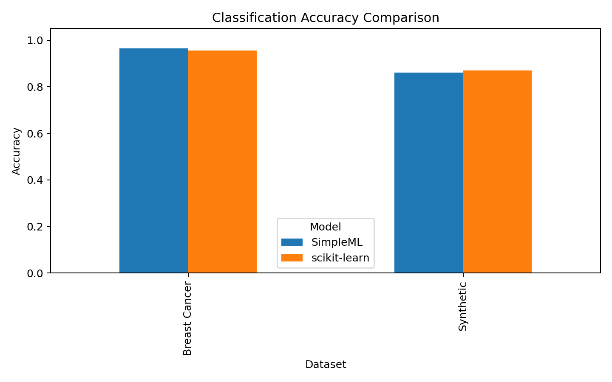
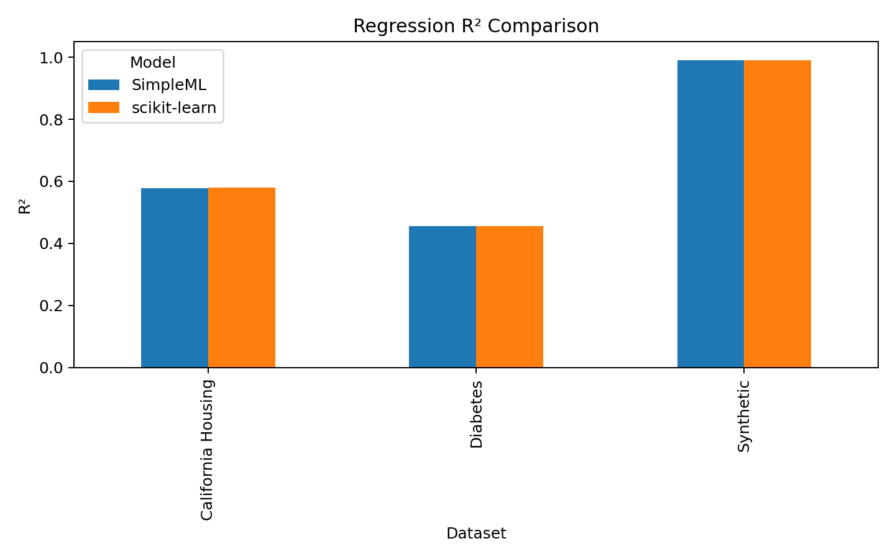

# SimpleML

[](https://github.com/AhmedElshazlyAE/simpleML/actions/workflows/tests.yml)


SimpleML is a small machine learning library I built from scratch with NumPy.

The goal was to understand what happens behind the API: how SGD updates weights, why scaling matters, how regularization changes the gradients, how early stopping is implemented, and how a simple pipeline can prevent messy preprocessing code.

I used scikit-learn mainly as a reference point to check whether my implementations behave reasonably on small regression and binary classification problems.

---

## What I built

### Models

- `SGDRegressor`
  - mini-batch stochastic gradient descent
  - optional intercept fitting
  - L2 regularization
  - inverse-scaling learning rate schedule
  - early stopping with patience
  - scikit-learn-like fitted attributes such as `coef_`, `intercept_`, and `n_features_in_`

- `SGDClassifier`
  - binary classification using a sigmoid decision function
  - mini-batch SGD
  - `predict`, `predict_proba`, and `decision_function`
  - L2 regularization
  - learning-rate scheduling
  - early stopping support

### Preprocessing

- `StandardScaler`
  - stores training-set mean and standard deviation
  - handles constant columns by avoiding division by zero
  - supports `fit`, `transform`, and `fit_transform`

### Model selection

- `train_test_split`
  - splits `X` and `y`
  - supports `test_size`
  - supports reproducibility through `random_state`

### Metrics

Regression metrics:

- mean squared error
- root mean squared error
- mean absolute error
- R² score
- regression report

Classification metrics:

- accuracy
- precision
- recall
- F1 score
- classification report

### Pipeline

- `Pipeline`
- `make_pipeline`
- `named_steps`
- chained preprocessing + estimator training
- prediction after applying the same fitted transformations

### Testing and CI

The project includes tests for:

- scaler behavior
- train/test splitting
- regression metrics
- classification metrics
- SGD regressor behavior
- SGD classifier behavior
- pipeline fitting and prediction

The tests are also configured to run through GitHub Actions.

---

## Project structure

```text
simpleML/
│
├── simpleml/
│   ├── linear_models/
│   │   ├── _SGDRegressor.py
│   │   └── _SGDClassifier.py
│   │
│   ├── preprocessing/
│   │   └── _scalers.py
│   │
│   ├── metrics/
│   │   ├── _regression.py
│   │   └── _classification.py
│   │
│   ├── model_selection/
│   │   └── _selection.py
│   │
│   ├── pipeline/
│   │   └── _pipeline.py
│   │
│   ├── optimizers/
│   ├── regularizers/
│   └── schedulers/
│
├── tests/
│   ├── test_metrics.py
│   ├── test_pipeline.py
│   ├── test_scaler.py
│   ├── test_sgd_classifier.py
│   ├── test_sgd_regressor.py
│   └── test_train_test_split.py
│
├── examples/
│   ├── classification_comparison.ipynb
│   └── regression_comparison.ipynb
│
├── .github/workflows/
│   └── tests.yml
│
├── pyproject.toml
└── README.md
```

---

## Installation

Clone the repository:

```bash
git clone https://github.com/AhmedElshazlyAE/simpleML.git
cd simpleML
```

Install it in editable mode:

```bash
python -m pip install -e .
```

For running the notebooks and tests:

```bash
python -m pip install -e ".[dev]"
```

---

## Quick start

### Regression

```python
from simpleml.pipeline import make_pipeline
from simpleml.preprocessing import StandardScaler
from simpleml.linear_models import SGDRegressor

model = make_pipeline(
    StandardScaler(),
    SGDRegressor(
        learning_rate="invscaling",
        eta0=0.01,
        max_iter=1000,
        random_state=42
    )
)

model.fit(X_train, y_train)
predictions = model.predict(X_test)
```

### Classification

```python
from simpleml.pipeline import make_pipeline
from simpleml.preprocessing import StandardScaler
from simpleml.linear_models import SGDClassifier

model = make_pipeline(
    StandardScaler(),
    SGDClassifier(
        learning_rate="invscaling",
        eta0=0.01,
        max_iter=1000,
        random_state=42
    )
)

model.fit(X_train, y_train)
predictions = model.predict(X_test)
probabilities = model.predict_proba(X_test)
```

### Using metrics

```python
from simpleml.metrics import accuracy_score, f1_score
from simpleml.metrics import mean_squared_error, r2_score

accuracy = accuracy_score(y_test, predictions)
f1 = f1_score(y_test, predictions)

mse = mean_squared_error(y_test, predictions)
r2 = r2_score(y_test, predictions)
```

---

## Experiments

I compared SimpleML against scikit-learn using the same train/test splits, scaling step, and similar SGD hyperparameters.

The comparison notebooks are in:

- [`examples/classification_comparison.ipynb`](examples/classification_comparison.ipynb)
- [`examples/regression_comparison.ipynb`](examples/regression_comparison.ipynb)

---

## Classification comparison

Datasets used:

- Synthetic binary classification dataset from `make_classification`
- Breast Cancer dataset from scikit-learn

Both models were trained inside a pipeline:

```text
StandardScaler → SGDClassifier
```

| Dataset | Model | Accuracy | Precision | Recall | F1 Score |
|---|---:|---:|---:|---:|---:|
| Synthetic Classification | SimpleML SGDClassifier | 0.8600 | 0.8913 | 0.8200 | 0.8542 |
| Synthetic Classification | scikit-learn SGDClassifier | 0.8700 | 0.8936 | 0.8400 | 0.8660 |
| Breast Cancer | SimpleML SGDClassifier | 0.9649 | 0.9722 | 0.9722 | 0.9722 |
| Breast Cancer | scikit-learn SGDClassifier | 0.9561 | 0.9589 | 0.9722 | 0.9655 |



The main thing I took from this experiment is that the custom classifier can learn a meaningful linear decision boundary. The results are not exactly the same as scikit-learn, which makes sense because scikit-learn has a much more mature and optimized implementation, but the numbers are close enough to show that the core logic is working.

---

## Regression comparison

Datasets used:

- Synthetic regression dataset from `make_regression`
- Diabetes dataset from scikit-learn
- California Housing dataset from scikit-learn

Both models were trained inside a pipeline:

```text
StandardScaler → SGDRegressor
```

| Dataset | Model | R² | MSE | MAE |
|---|---:|---:|---:|---:|
| Synthetic Regression | SimpleML SGDRegressor | 0.9911 | 105.8309 | 8.3933 |
| Synthetic Regression | scikit-learn SGDRegressor | 0.9910 | 106.5264 | 8.4042 |
| Diabetes | SimpleML SGDRegressor | 0.4568 | 2877.8434 | 42.8744 |
| Diabetes | scikit-learn SGDRegressor | 0.4557 | 2883.7200 | 42.9006 |
| California Housing | SimpleML SGDRegressor | 0.5775 | 0.5537 | 0.5330 |
| California Housing | scikit-learn SGDRegressor | 0.5798 | 0.5506 | 0.5299 |



The synthetic regression result was useful because the data follows a mostly linear relationship, so it was a good first check for the gradient update logic. The real datasets were more useful for testing whether the code still behaves reasonably outside a controlled toy problem.

---

## What I learned

This project helped me understand several parts of machine learning that are easy to ignore when only using high-level libraries.

### 1. Feature scaling is not optional for SGD

When features are on very different scales, the gradient updates become unstable or slow. Building `StandardScaler` and then using it inside a pipeline made the effect of scaling much clearer.

### 2. A model is more than the main equation

Writing the model was not only about:

```text
y = XW + b
```

or:

```text
sigmoid(XW + b)
```

The harder parts were around the training loop: batching, shuffling, learning-rate decay, stopping conditions, validation splitting, and keeping the API predictable.

### 3. Reproducibility matters

Adding `random_state` made it much easier to debug the implementation and compare results fairly with scikit-learn.

### 4. Pipelines reduce mistakes

At first, it is easy to scale the training data and forget to apply the same transformation to the test data. Implementing a basic pipeline helped me understand why libraries use fitted transformers and why preprocessing should be part of the model workflow.

### 5. Tests expose design problems early

The tests caught issues in imports, naming, and API consistency before the project became larger. This made the project feel more like a small library and less like a collection of scripts.

---

## Running the tests

```bash
python -m pytest -q
```

The tests cover the core behavior of the library: preprocessing, splitting, metrics, model fitting, prediction, and pipeline behavior.

---

## Current limitations

This project is educational. It is not meant to compete with scikit-learn.

Current limitations:

- only supports binary classification
- no multiclass classifiers yet
- no cross-validation
- limited input validation compared with production ML libraries
- limited optimizer options
- no model serialization utilities yet
- no sparse matrix support
- no full documentation site yet

These limitations are intentional for now. I wanted to build the core ideas first instead of hiding everything behind too many features.

---

## Possible next steps

Things I may add later:

- multiclass classification
- cross-validation
- model saving and loading
- more preprocessing tools
- better documentation
- more benchmark notebooks
- cleaner error messages for invalid inputs

---

## Why this project matters to me

I built this project because I wanted to understand machine learning from the inside. Using scikit-learn is useful, but implementing a small part of it forced me to think about gradients, shapes, metrics, reproducibility, and API design in a much more practical way.

This project is still small, but it made me more confident reading ML code and debugging training behavior instead of treating models as black boxes.
